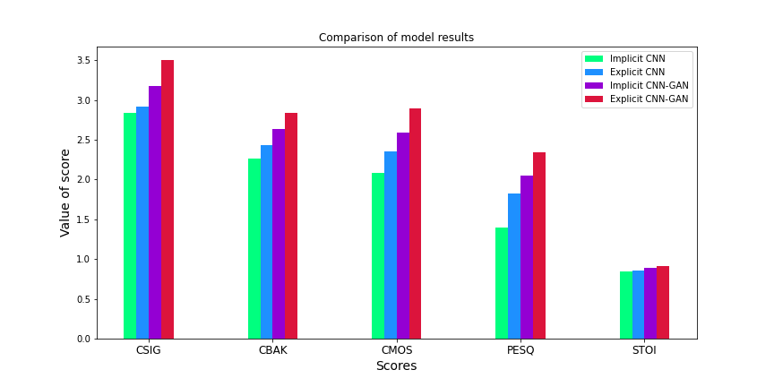

# Speech-enhancement using GAN
We develop a time-freqency mask based convolutional generative adversarial (CNN-GAN) network for speech enhancement. Further, we compare its performance with the convolutional neural network based speech enhancement model and non-explicit mask based CNN-GAN based models. Performance evaluation metrics establish the superiority of explicit mask-based CNN-GAN over its counterparts.

## Dataset
We use the dataset released by Valentini et. al. in our experiments. It consists of 30 speakers from the Voice Bank corpus mismatched conditions. The noise samples are taken from Demand database. 
- The training set contains 28 English speakers and the test set contains 2 English speakers, with around 400 sentences each, both for the clean and noisy set. 
- All the sentences are sampled at 48 kHz. 
- The training set explores 40 different noisy conditions with 10 types of noise and 4 SNR each (15, 10, 5, and 0 dB). 
- The test set comprises 20 different noisy conditions with 5 types of noise and 4 SNR each (17.5, 12.5, 7.5, and 2.5 dB). 
- The train and test set contains 11572 and 824 utterances, respectively.
## Architecture details

## Results

  
|Metric| Noisy| CNN|CNN| CNN-GAN|CNN-GAN|
|------|------|----|------|--------|-------|
|||Implicit| Explicit| Implicit| Explicit|
|CSIG |3.35 |2.84 |2.92 |3.18 |3.50|
|CBAK |2.44 |2.26 |2.43 |2.64 |2.84|
|COVL |2.63 |2.08 |2.35 |2.59 |2.90|
|PESQ |1.97 |1.40 |1.83 |2.05 |2.34|
|STOI |0.91 |0.85 |0.86 |0.89 |0.91|

<b>Table 1: Comparison between implicit and explicit mask estimation for CNN and CNN-GAN</b>

  
  

<b>Fig. 1: Comparison between implicit and explicit mask estimation for CNN and CNN-GAN</b>

  
|Metric |Noisy |CNN |CNN|CNN-GAN|CNN-GAN|
|:----:|:----:|:----:|:----:|:----:|:----:|
|||Normalised Input|Standardised Input|Adam| SGD|
|CSIG |3.35 |2.84 |2.24 |1.01 |3.50|
|CBAK |2.44 |2.26 |2.17 |1.93 |2.84|
|COVL |2.63 |2.08 |1.95 |1.06 |2.90|
|PESQ |1.97 |1.40 |1.80 |1.46 |2.34|
|STOI |0.91 |0.85 |0.80 |0.71 |0.91|
  

<b>Table 2: Comparison between CNN and CNN-GAN mask based estimation</b>

  
|Metric |Noisy |CNN |CNN|CNN-GAN|CNN-GAN|
|:----:|:----:|:----:|:----:|:----:|:----:|
|||Linear| Sigmoid| Linear| Sigmoid|
|CSIG |3.35 |2.84 |2.06 |3.34 |2.43|
|CBAK |2.44 |2.26 |2.16 |2.66 |1.88|
|COVL |2.63 |2.08 |1.80 |2.65 |1.84|
|PESQ |1.97 |1.40 |1.69 |2.02 |1.37|
|STOI |0.91 |0.85 |0.81 |0.91 |0.75|
  

<b>Table 3: Effect of Activation for CNN and CNN-GAN</b>

## System Information
- Python >= 3.0
- Pytorch >= 2.0
- Tensorflow >=2.0
