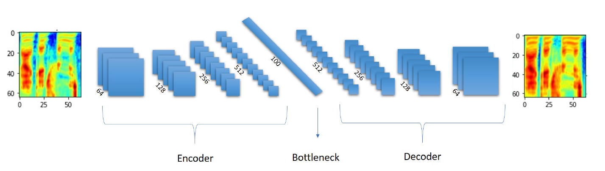
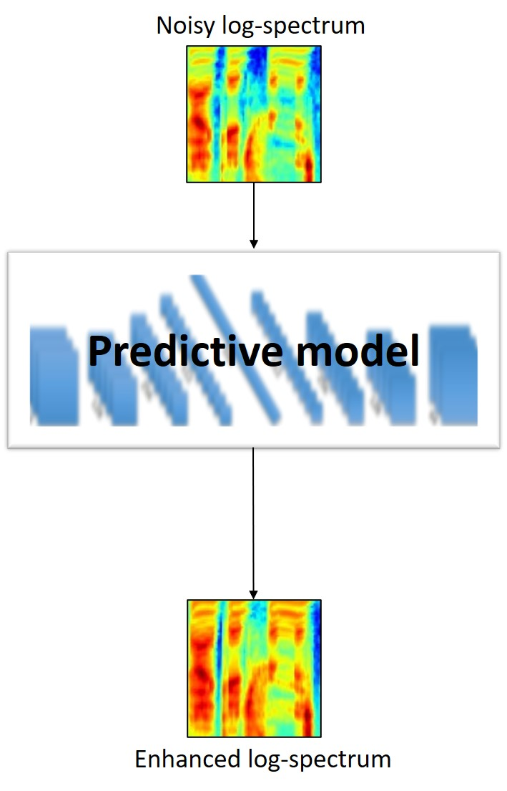
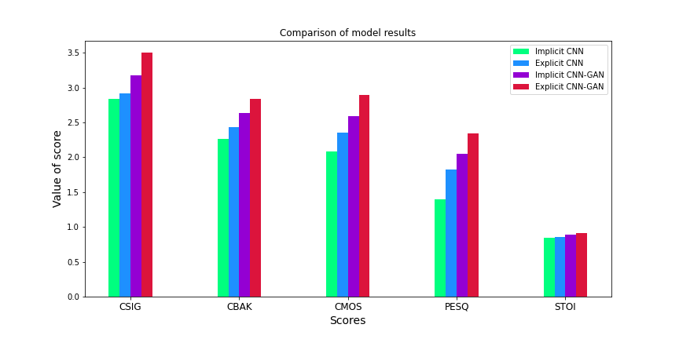
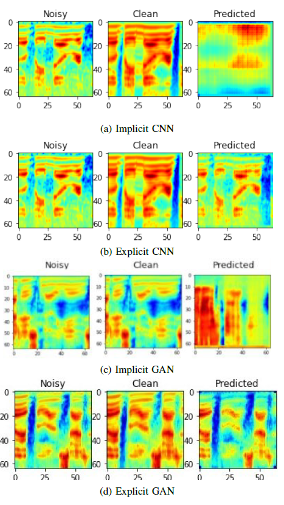

# Speech-enhancement using GAN
We develop a time-freqency mask based convolutional generative adversarial (CNN-GAN) network for speech enhancement. Further, we compare its performance with the convolutional neural network based speech enhancement model and non-explicit mask based CNN-GAN based models. Performance evaluation metrics establish the superiority of explicit mask-based CNN-GAN over its counterparts.

## Dataset
We use the dataset released by [Valentini et. al.](https://datashare.ed.ac.uk/handle/10283/1942?show=full) in our experiments. It consists of 30 speakers from the Voice Bank corpus mismatched conditions. The noise samples are taken from Demand database. 
- The training set contains 28 English speakers and the test set contains 2 English speakers, with around 400 sentences each, both for the clean and noisy set. 
- All the sentences are sampled at 48 kHz. 
- The training set explores 40 different noisy conditions with 10 types of noise and 4 SNR each (15, 10, 5, and 0 dB). 
- The test set comprises 20 different noisy conditions with 5 types of noise and 4 SNR each (17.5, 12.5, 7.5, and 2.5 dB). 
- The train and test set contains 11572 and 824 utterances, respectively.

### Preprocessing
- The input signals are downsampled from 48kHz to 16kHz and applied a pre-emphasis of 0.95. 64-channel gammatone features are extracted using 20ms Hamming window with 50% (10 ms) overlap with adjacent frames. 
- The log-spectrum is computed from the gammatone features. 
- We experiment the effect of normalisation (log-spectrum values restricted between 0-1) and standardisation i.e., mean normalisation on the model performance, and establish that normalisation is more preferable. 
- Each audio spectrum is further subdivided into 64\*64 log-patches. 
- These patches are created using a sliding window with 50% overlap during training and no overlap for test set.

## Architecture details

  
  
  

  

<b>Fig. 1: Encoder-decoder architecture of CNN. The same architecture is used for the G network of CNN-GAN </b>

**CNN Architecture:** We set up our network with an architecture similar to encoder-decoder models. The encoding stage consists of 4 layers of 64, 128, 256 and 512 filter depth. Each filter has a kernel size of 4 with stride length as 2. This encoder learns the spatial downsampling while extracting the low-dimensional features which is structured as a bottleneck with 100 units. The decoder is the transpose of encoder as it aims to project the learnt features to original space. It consists of filters of size 512, 256, 128, and 64 in each layer with kernel size 4 and stride length of 2. In all the experiments, we train the model for 50 epochs using Adam optimizer and Mean square error (MSE) loss.

**CNN-GAN Architecture:** The GAN consists of two networks: Generator (G) and Discriminator (D). The G is trained to learn the TF mask and the discriminator tries to distinguish between enhanced and clean spectrograms. We model G with similar architecture as CNN, while D has six layers of filter size of [64, 128, 256, 512, 64, 1] dimension with kernel size 4 and stride length of 2. In all experiments, we train the model for 25 epochs with Adam optimizer for CNN and G network, and SGD for D network. The D network minimizes the binary cross-entropy (BCE) loss and the G network minimizes the MSE error between enhanced and clean log-spectrum.

  
   

<b>Fig. 2: Flowchart of implemented algorithms</b>

**Implicit masking:** We implemented both CNN and CNN-GAN models to implicitly predict the mask. As shown in fig. 2, in implicit masking method the spectrogram is directly predicted by the model while the mask is implicit.

**Explicit masking:** We also implemented our CNN and CNN-models to explicitly predict the mask. In this case, the model outputs the mask which is then multiplied with the input noisy spectrogram to get the final clean predicted spectrogram as shown in fig. 2.

## **Evaluation**
The predicted masks for the testing set were stitched back together from 64\*64 pathces and .wav audio files were reconstructed back in MATLAB from the predicted gammatone spectrograms. The model was then evaluated using the CSIG, CBAK, COVL, PESQ and STOI speech metrics using the predicted audio files and clean audio files.

## Results
### Explicit masking vs Implicit masking method

<b>Table 1: Comparison between implicit and explicit mask estimation for CNN and CNN-GAN</b>

  
|Metric| Noisy| CNN|CNN| CNN-GAN|CNN-GAN|
|------|------|----|------|--------|-------|
|||**Implicit**| **Explicit**| **Implicit**| **Explicit**|
|CSIG |3.35 |2.84 |2.92 |3.18 |**3.50**|
|CBAK |2.44 |2.26 |2.43 |2.64 |**2.84**|
|COVL |2.63 |2.08 |2.35 |2.59 |**2.90**|
|PESQ |1.97 |1.40 |1.83 |2.05 |**2.34**|
|STOI |0.91 |0.85 |0.86 |0.89 |**0.91**|

    

<b>Fig. 3: Comparison between implicit and explicit mask estimation for CNN and CNN-GAN</b>

We compared the performance of implicit and explicit masking based methods for speech enhancement. We observed that explicit mask based method, in which the mask is predicted explicitly by the deep learing model, showed superior results as summarized in table 1. Thus, the usage of masks (explicit models) for speech enhancement is a feasible method and yields significantly better results than the implicit models which directly predicts the spectrogram.

### Estimation using CNN vs CNN-GAN 

<b>Table 2: Comparison between CNN and CNN-GAN mask based estimation</b>

  
|Metric |Noisy |CNN |CNN|CNN-GAN|CNN-GAN|
|:----:|:----:|:----:|:----:|:----:|:----:|
|||**Normalised Input**|**Standardised Input**|**Adam**| **SGD**|
|CSIG |3.35 |**2.84** |2.24 |1.01 | **3.50**|
|CBAK |2.44 |**2.26** |2.17 |1.93 | **2.84**|
|COVL |2.63 |**2.08** |1.95 |1.06 | **2.90**|
|PESQ |1.97 |**1.40** |1.80 |1.46 | **2.34**|
|STOI |0.91 |**0.85** |0.80 |0.71 | **0.91**|
  

We evaluated the effect of preprocessing (Normalisation vs standardisation of gammatone spectrograms) on model results. Results summarized in table 2 shows that normalisation of data yields a better performances than standardising. Also, for CNN-GAN we observed usin an SGD optimizer for the discriminator network helped to converge the model faste and yielded a better performance.

### Effects of activation function

<b>Table 3: Effect of Activation for CNN and CNN-GAN</b>

  
|Metric |Noisy |CNN |CNN|CNN-GAN|CNN-GAN|
|:----:|:----:|:----:|:----:|:----:|:----:|
|||**Linear**| **Sigmoid**| **Linear**| **Sigmoid**|
|CSIG |3.35 |**2.84** |2.06 |**3.34** |2.43|
|CBAK |2.44 |**2.26** |2.16 |**2.66** |1.88|
|COVL |2.63 |**2.08** |1.80 |**2.65** |1.84|
|PESQ |1.97 |**1.40** |1.69 |**2.02** |1.37|
|STOI |0.91 |**0.85** |0.81 |**0.91** |0.75|
  

We observed that removing the activation function from the last layer, which predicts the mask for both our explicit CNN and explicit GAN, improved cleaned speech quality as shown in table 3. This is because a linear activation aids in generating a more flexible mask which can take up values in the desired ranges without restriction.

  

<b>Fig. 4: Predictions of implemented models</b>
 

## System Information
- Python >= 3.0
- Pytorch >= 2.0
- Tensorflow >=2.0

## References
N. Shah, H. A. Patil and M. H. Soni,*"Time-Frequency Mask-based Speech Enhancement using Convolutional Generative Adversarial Network,"* 2018 Asia-Pacific Signal and Information Processing Association Annual Summit and Conference (APSIPA ASC), 2018, pp. 1246-1251, doi: 10.23919/APSIPA.2018.8659692.

M. H. Soni, N. Shah and H. A. Patil, *"Time-Frequency Masking Based Speech Enhancement Using Generative Adversarial Network,"* 2018 IEEE International Conference on Acoustics, Speech and Signal Processing (ICASSP), 2018, pp. 5039-5043,doi:10.1109/ICASSP.2018.8462068.
